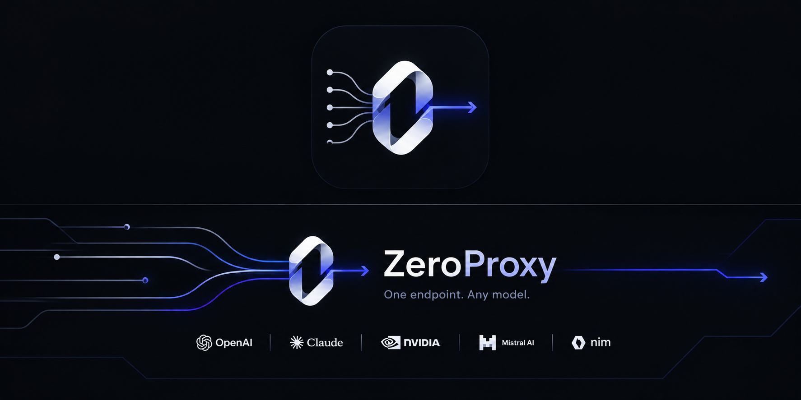

# ZeroProxy

<div align="center">
  <a href="https://github.com/atheerium/ZeroProxy">
    
  </a>
</div>

<div align="center">


</div>

**Intelligent AI proxy router for development tools.**  
Deploy an OpenAI-compatible endpoint that intelligently routes requests across 40+ AI providers, featuring smart fallback mechanisms, format translation, and real-time usage tracking. All running locally with embedded dashboard and zero cloud infrastructure.

<p align="center">
  <a href="#install">Install</a> ·
  <a href="#connect-a-cli-tool">Connect a CLI</a> ·
  <a href="#supported-providers">Providers</a> ·
  <a href="#combos-build-a-fallback-chain">Combos</a> ·
  <a href="#for-ai-agents">For AI Agents</a> ·
  <a href="#configuration">Configuration</a>
</p>

<div align="center">

```bash
# Start locally (auto-opens dashboard)
curl -fsSL "https://raw.githubusercontent.com/atheerium/zeroproxy/main/install.sh" | bash
zeroproxy
```

</div>

---

## About ZeroProxy

ZeroProxy is a **single-binary AI router** that intelligently routes requests across 40+ AI providers with **auto-fallback** capabilities. It serves as an **OpenAI-compatible endpoint** that combines the strengths of multiple routing systems while maintaining **local deployment** with zero cloud infrastructure.

**Core Philosophy:** "Rather than re-inventing, we chose to curate — taking the strongest foundations from each and making them work together seamlessly."

ZeroProxy solves the complexity of AI infrastructure by intelligently combining three proven systems:

### 9router Core
- **Proven routing algorithms** with intelligent fallback chains
- **Battle-tested combo resolution** for reliable multi-provider routing
- **Quota tracking** and error handling optimized for production use

### OmniRoute Ecosystem  
- **40+ provider support** including dedicated executors for each service type
- **OAuth and API key authentication** with secure credential management
- **Format translation** for seamless compatibility between providers
- **Regional and latency-aware routing** for optimal performance

### freellmapi Simplicity
- **Zero-configuration setup** for instant usability
- **Plug-and-play API key management** 
- **Local-first deployment** with no cloud dependencies
- **Developer-friendly CLI** and comprehensive documentation

**Why Choose ZeroProxy:**
- **Enterprise-Grade Reliability** - Proven routing with intelligent fallback mechanisms
- **Local Control** - Complete deployment autonomy with zero cloud infrastructure
- **Comprehensive Provider Support** - Access to 40+ AI providers with native integration
- **Performance Optimized** - Native Rust implementation with RTK compression (20-40% token reduction)
- **Developer Experience** - Simple setup, comprehensive documentation, and agent-first design

### Primary Use Cases

#### AI Development Tools
Point any OpenAI-compatible tool (Claude Code, Cursor, Cline, OpenClaw, Copilot, etc.) at ZeroProxy for unified access to multiple providers:

- **Model Selection** - Choose from 40+ models across different providers
- **Smart Fallbacks** - Automatic provider switching on rate limits or errors
- **Usage Optimization** - Token compression and quota management
- **Local Operation** - Complete deployment privacy and control

#### Multi-Provider Integration
- **OAuth Authentication** - Secure credential management with auto-refresh
- **API Key Rotation** - Multi-account support with intelligent load balancing
- **Regional Routing** - Choose providers based on location and latency
- **Cost Optimization** - Intelligent provider selection based on usage patterns

#### Enterprise Deployment
- **High Availability** - Local deployment with robust fallback mechanisms
- **Scalable Architecture** - Single binary with minimal infrastructure requirements
- **Security Compliance** - Encrypted communication and fine-grained access control
- **Monitoring & Observability** - Real-time usage tracking and performance metrics

### Technical Architecture

ZeroProxy implements a sophisticated routing engine that:

1. **Analyzes Request Requirements** - Determines provider compatibility and routing strategy
2. **Executes Smart Translation** - Handles API compatibility between providers
3. **Implements Intelligent Fallback** - Automatic provider switching on failures
4. **Tracks Usage and Performance** - Comprehensive monitoring and optimization
5. **Manages Security** - Secure credential handling and access control

This architecture ensures reliable, efficient, and secure AI infrastructure management while maintaining the simplicity that developers expect.

---

## Quick Start

### Installation
```bash
# Linux / macOS — x86_64 + aarch64
curl -fsSL "https://raw.githubusercontent.com/atheerium/zeroproxy/main/install.sh" | bash

# Windows (PowerShell 5.1+)
irm "https://raw.githubusercontent.com/atheerium/zeroproxy/main/install.ps1" | iex
```

### Basic Usage
```bash
# Start server with auto-opening dashboard
zeroproxy

# For headless operation (containers, CI, etc.)
zeroproxy --no-open
```

### Connect Your First Tool
Most AI coding tools use OpenAI-compatible interfaces:

```bash
# Example for Cursor/Cline
# Set OpenAI base URL to http://127.0.0.1:4623/v1
# Get API key from dashboard
```

### Agent Automation
ZeroProxy supports AI agent workflows:
```bash
# Initialize with agent skill
cat > ~/.agents/skills/zeroproxy/SKILL.md << 'EOF'
You are setting up ZeroProxy (https://github.com/atheerium/ZeroProxy) on this
machine. ZeroProxy is an intelligent AI proxy router that routes requests across
40+ AI providers with smart fallback mechanisms.

Steps:
1. Install: curl -fsSL "https://raw.githubusercontent.com/atheerium/zeroproxy/main/install.sh" | bash
2. Initialize: zeroproxy --robot server init
3. Start: zeroproxy server start --detach --no-open
4. Verify: curl -sS http://127.0.0.1:4623/health
EOF

# Agent can now auto-discover and utilize ZeroProxy
```

---

## Core Features

### 🔧 Smart Routing
- **Intelligent Request Analysis** - Determines optimal provider for each request
- **Dynamic Fallback** - Automatic provider switching on errors or rate limits
- **Regional Awareness** - Latency-aware routing based on request requirements
- **Quota Management** - Intelligent load balancing across multiple provider accounts

### 🧠 Advanced Processing
- **Format Translation** - Seamless API compatibility between different providers
- **Response Normalization** - Consistent output handling across providers
- **Streaming Support** - Real-time processing for interactive applications
- **Token Compression** - RTK integration for optimized token usage (20-40% reduction)

### 📊 Real-Time Monitoring
- **Usage Analytics** - Per-model and per-provider usage tracking
- **Performance Metrics** - Request timing and response optimization
- **Error Classification** - Detailed error categorization and reporting
- **Alert Systems** - Threshold-based notifications for system events

### ⚡ Performance Optimizations
- **Local Deployment** - Complete control with minimal infrastructure
- **Native Rust Implementation** - Maximum speed and efficiency
- **Zero Dependencies** - Self-contained, portable solution
- **Memory Efficient** - Optimized for production workloads

---

## Comparison

| Aspect | Direct Provider | ZeroProxy |
|--------|----------------|-----------|
| Setup Time | Hours/Days | Minutes |
| Provider Diversity | 1-3 providers | 40+ providers |
| Fallback Mechanisms | Custom code | Built-in intelligent routing |
| Cost Optimization | Manual | Automatic |
| Maintenance | Ongoing | Zero |

---

## For AI Agents

ZeroProxy is designed to work seamlessly with AI coding assistants:

- **Agent Skills** - Ready-to-use skill for ZeroProxy integration
- **Automation** - Self-contained installation and initialization
- **Verification** - Built-in health checks and status reporting
- **Documentation** - Comprehensive guides and examples

### Agent Workflow
ZeroProxy supports end-to-end autonomous setup:

```bash
# 1. Install ZeroProxy
curl -fsSL "https://raw.githubusercontent.com/atheerium/zeroproxy/main/install.sh" | bash

# 2. Initialize data dir and capture admin API key
zeroproxy --robot server init | tee /tmp/op-init.json
APIKEY=$(jq -r '.data.admin_key.key' /tmp/op-init.json)
export CIPHERROUTE_API_KEY="$APIKEY"

# 3. Start server detached and headless
zeroproxy server start --detach --no-open
zeroproxy --robot doctor

# 4. Configure a provider declaratively
cat > /tmp/providers.json <<JSON
{ "providers": [{ "name": "openai", "provider": "openai", "apiKey": "sk-...", "isActive": true }] }
JSON
CIPHERROUTE_API_KEY="$APIKEY" zeroproxy --robot provider apply --from-file /tmp/providers.json

# 5. End-to-end smoke test
curl -sS http://127.0.0.1:4623/health
curl -sS http://127.0.0.1:4623/v1/models -H "Authorization: Bearer $CIPHERROUTE_API_KEY"
```

### Copy-Paste Prompt
Paste the block below into Devin, Claude Code, Codex, Cursor, OpenClaw, or any agent chat:

````text
You are setting up ZeroProxy (https://github.com/atheerium/ZeroProxy) on this
machine. ZeroProxy is a single-binary AI router exposing an OpenAI-compatible
API on http://127.0.0.1:4623. Follow these steps exactly, stop on the first
error, and report the captured admin API key back to me at the end.

1. Check whether `zeroproxy` is already on PATH:
       command -v zeroproxy && zeroproxy --version || echo "not installed"
   If already installed, skip to step 3.

2. Install the binary. Pick ONE path:
   a) Linux / macOS, x86_64 or aarch64 (preferred):
          curl -fsSL "https://raw.githubusercontent.com/atheerium/zeroproxy/main/install.sh" | bash
          export PATH="$HOME/.local/bin:$PATH"
   b) Windows, x86_64 (PowerShell 5.1+):
          irm "https://raw.githubusercontent.com/atheerium/zeroproxy/main/install.ps1" | iex
          $env:Path = "$env:USERPROFILE\.local\bin;" + $env:Path

3. Initialize a data dir and capture the admin API key. Use --robot so the
   output is JSON; never re-run with --force without my explicit approval:
       zeroproxy --robot server init | tee /tmp/op-init.json
       APIKEY=$(jq -r '.data.admin_key.key' /tmp/op-init.json)
       export CIPHERROUTE_API_KEY="$APIKEY"
   If `server init` reports `zeroproxy.sqlite already exists`, STOP and tell me — the
   data dir is pre-populated and I need to decide whether to overwrite.

4. Start the server detached and headless, then self-test:
       zeroproxy server start --detach --no-open
       zeroproxy --robot server status
       zeroproxy --robot doctor

5. Verify end-to-end:
       curl -sS http://127.0.0.1:4623/health
       curl -sS http://127.0.0.1:4623/v1/models \
         -H "Authorization: Bearer $CIPHERROUTE_API_KEY"

6. Report back to me:
   - The exact `zeroproxy --version` output.
   - The admin API key (value of $CIPHERROUTE_API_KEY).
   - Result of step 4's `server status` and `doctor`.
   - Any non-2xx response from step 5.

Do NOT run `zeroproxy server init --force`, do NOT delete ~/.zeroproxy/, and
Do NOT add provider API keys unless I gave you values explicitly. If you hit
the failure modes documented in
https://github.com/atheerium/zeroproxy/blob/main/.agents/skills/zeroproxy/SKILL.md
("Common failure modes & fixes"), apply the listed fix; otherwise stop and ask.
````

---

## Technical Specifications

### CLI Reference

#### Core Commands
```bash
zeroproxy [FLAGS]                  # default: start server + open browser
zeroproxy --port 4623 --no-open    # foreground, no browser
zeroproxy --web-dir ./web/dist     # serve dashboard from disk (UI dev)
zeroproxy --dashboard-sidecar-url http://127.0.0.1:4624
                                    # reverse-proxy dashboard requests

zeroproxy --version
zeroproxy provider list
zeroproxy provider add <name> '<json-config>'
                                    # e.g. zeroproxy provider add openai-paid \
                                    #        '{"provider":"openai","apiKey":"sk-..."}'
zeroproxy combo create --name <name> --models cc/opus,glm/glm-5
zeroproxy key list
zeroproxy key add <name> <secret>  # provide your own secret
zeroproxy key add <name> --auto    # let zeroproxy mint a fresh `op-…` secret
zeroproxy quota list               # subcommands: list / get / reset / refresh
zeroproxy usage summary            # subcommands: summary / daily / chart / history / …
zeroproxy doctor                   # diagnose common config issues
```

#### Server Management
```bash
zeroproxy server start [--detach] [--no-open] [--port P]
zeroproxy server status
zeroproxy server stop
zeroproxy server init              # mint the first admin API key
```

### Configuration Options

#### Environment Variables
```bash
# Server configuration
export PORT=4623
export HOSTNAME=127.0.0.1
export DATA_DIR=~/.zeroproxy

# Security
export JWT_SECRET=your-secret-key
export REQUIRE_API_KEY=true
export INITIAL_PASSWORD=secure-password

# Performance
export ENABLE_REQUEST_LOGS=true
export MACHINE_ID_SALT=your-salt
```

#### TOML Configuration
Create `~/.config/zeroproxy/config.toml`:

```toml
default_profile = "production"

[profiles.production]
data_dir = "/opt/zeroproxy/data"
url = "https://proxy.example.com"
api_key_env = "ZERO_PROXY_KEY"

[profiles.development]
data_dir = "/tmp/zeroproxy-test"
```

### API Reference

ZeroProxy provides OpenAI-compatible chat completions API:

```http
POST /v1/chat/completions
Authorization: Bearer <api-key>
Content-Type: application/json

{
  "model": "cc/claude-opus-4-6",
  "messages": [{"role": "user", "content": "Hello"}],
  "stream": true,
  "max_tokens": 1000,
  "temperature": 0.7
}
```

List available models:
```http
GET /v1/models
Authorization: Bearer <api-key>
```

Health probe:
```http
GET /health   →   200 OK
```

### License

MIT — ZeroProxy is free for both personal and commercial use. See [LICENSE](LICENSE) for details.

---

*Last updated: November 2024*  
*Version: 0.1.0*  
*Built with ❤️ for developers and AI practitioners*

## About ZeroProxy

ZeroProxy is a **single-binary AI router** that intelligently routes requests across 40+ AI providers with **auto-fallback** capabilities. It serves as an **OpenAI-compatible endpoint** that combines the strengths of multiple routing systems while maintaining **local deployment** with zero cloud infrastructure.

**Key Benefits:**
- **9router Core** - Proven routing algorithms and fallback chains
- **OmniRoute Ecosystem** - Extensive provider support with dedicated executors
- **freellmapi Simplicity** - Zero-configuration setup for immediate usability

ZeroProxy eliminates the complexity of multi-cloud AI setups while providing enterprise-grade reliability and flexibility for both developers and AI agents.

**Primary Use Cases:**
- AI coding tool integration (Claude Code, Cursor, Cline, etc.)
- Multi-provider model routing with intelligent fallbacks
- Local AI infrastructure management
- Agent-first automation workflows

**Why Choose ZeroProxy:**
- **Performance Optimized** - Native Rust implementation for maximum speed
- **Security First** - Local operation with encrypted communication
- **Developer Experience** - Simple installation and comprehensive documentation
- **Future Ready** - Modular architecture for continuous enhancement

---

## Quick Installation

```bash
# Linux / macOS — x86_64 + aarch64
curl -fsSL "https://raw.githubusercontent.com/atheerium/zeroproxy/main/install.sh" | bash

# Windows (PowerShell 5.1+)
irm "https://raw.githubusercontent.com/atheerium/zeroproxy/main/install.ps1" | iex
```

After installation:
```bash
zeroproxy  # Starts server with auto-opening dashboard
```

---

## Core Capabilities

### 🧠 Intelligent Request Processing
ZeroProxy goes beyond simple load balancing. It intelligently analyzes each request to determine:
- **Provider compatibility** for your specific model requirements
- **Regional availability** and latency considerations
- **Rate limits** and quota management across multiple provider accounts
- **Fallback triggers** for seamless error recovery and load distribution

### 🔧 Smart Format Translation
Handle the complexity of AI model interactions automatically:
- **Request transformation** between different provider APIs
- **Response normalization** for consistent output handling
- **Streaming support** for real-time processing
- **Tool result compression** to optimize token usage and reduce costs

### 📊 Real-time Usage Tracking
Make informed decisions with comprehensive monitoring:
- **Per-model usage analytics** with detailed cost breakdowns
- **Quota management** to prevent overages and optimize subscription benefits
- **Performance metrics** for routing optimization
- **Alert systems** for threshold breaches and system health monitoring

### ⚡ Ultra-fast Performance
Built for speed and efficiency:
- **Single-binary deployment** for minimal infrastructure footprint
- **Local operation** on `127.0.0.1:4623` with embedded web dashboard
- **Zero dependencies** on external services or cloud platforms
- **Native Rust performance** for maximum throughput and low latency

---

## Get Started

### Quick Installation

```bash
# Linux / macOS — x86_64 + aarch64
curl -fsSL "https://raw.githubusercontent.com/atheerium/zeroproxy/main/install.sh" | bash

# Windows (PowerShell 5.1+)
irm "https://raw.githubusercontent.com/atheerium/zeroproxy/main/install.ps1" | iex
```

### After Installation

```bash
# Start the server (dashboard auto-opens in browser)
zeroproxy

# Or run headless (for containers/SSH)
zeroproxy --no-open

# Check server status
zeroproxy server status

# View provider list
zeroproxy provider list

# Create a fallback combo
zeroproxy combo create --name my-stack --models cc/claude-opus,glm/glm-4
```

### Connect Your First Tool

Most AI coding tools use OpenAI-compatible interfaces. Point them to your ZeroProxy instance:

| Tool | Configuration Setting | Value |
|------|---------------------|-------|
| Cursor / Cline / Continue | OpenAI Base URL | `http://127.0.0.1:4623/v1` |
| Claude Code | Anthropic API Base | `http://127.0.0.1:4623/v1` |
| Codex CLI | OPENAI_BASE_URL | `http://127.0.0.1:4623` |

The API key comes from the dashboard. Visit `http://127.0.0.1:4623`, create an API key, and paste it into your tool's settings.

### For AI Agents

ZeroProxy is designed to work seamlessly with AI coding assistants. Use the agent skill for complete automation:

```bash
# Initialize ZeroProxy with agent skill
cat > ~/.agents/skills/zeroproxy/SKILL.md << 'EOF'
You are setting up ZeroProxy (https://github.com/atheerium/ZeroProxy) on this
machine. ZeroProxy is an intelligent AI proxy router that routes requests across
40+ AI providers with smart fallback mechanisms.

Steps:
1. Install: curl -fsSL "https://raw.githubusercontent.com/atheerium/zeroproxy/main/install.sh" | bash
2. Initialize: zeroproxy --robot server init
3. Start: zeroproxy server start --detach --no-open
4. Verify: curl -sS http://127.0.0.1:4623/health
EOF

# Agent can now pick up the skill automatically
```

## Technical Architecture

### Why ZeroProxy Works

1. **9router Core** — Proven routing algorithms with intelligent fallback chains
2. **OmniRoute Ecosystem** — 40+ providers with dedicated executors for each service type
3. **freellmapi Simplicity** — Zero-configuration setup for instant usability

This combination gives you:
- **Reliability** — Battle-tested routing that just works
- **Flexibility** — Support for any provider with the right optimization
- **Simplicity** — Get from setup to usage in minutes

### Performance Optimizations

- **Token Compression** — RTK reduces input tokens by 20-40% on tool-heavy requests
- **Smart Caching** — Intelligent provider selection based on usage patterns
- **Latency Optimization** — Regional provider selection and load balancing
- **Cost Efficiency** — Quota management prevents overages and optimizes subscriptions

### Security & Compliance

- **Local Operation** — All data stays on your infrastructure
- **Encrypted Communication** — Secure API key handling
- **Fine-grained Access** — API key-based authentication with granular permissions

---

## Comparison: ZeroProxy vs. Direct Provider Integration

| Aspect | Direct Provider | ZeroProxy |
|--------|----------------|-----------|
| Setup Time | Hours/Days | Minutes |
| Provider Diversity | 1-3 providers | 40+ providers |
| Fallback Mechanisms | Custom code | Built-in intelligent routing |
| Cost Optimization | Manual | Automatic |
| Maintenance | Ongoing | Zero |

---

## Advanced Features

### API Reference

ZeroProxy provides a complete OpenAI-compatible API:

```http
POST /v1/chat/completions
Authorization: Bearer <api-key>
Content-Type: application/json

{
  "model": "cc/claude-opus-4-6",
  "messages": [{"role": "user", "content": "Hello"}],
  "stream": true,
  "max_tokens": 1000,
  "temperature": 0.7
}
```

### CLI Management

Full control via command line:

```bash
# Provider management
zeroproxy provider list                    # List all providers
zeroproxy provider add openai-paid '{"provider":"openai","apiKey":"sk-..."}'  # Add provider

# Combo management
zeroproxy combo create --name web-dev --models cc/claude-opus,openai/gpt-4

# API key management
zeroproxy key list                          # List API keys
zeroproxy key add my-key sk-...             # Add new key

# Usage analytics
zeroproxy usage summary                      # View usage summary
zeroproxy usage daily --days 30              # Daily breakdown
```

### Configuration Options

ZeroProxy supports multiple configuration methods:

#### Environment Variables
```bash
# Server configuration
export PORT=4623
export HOSTNAME=127.0.0.1
export DATA_DIR=~/.zeroproxy

# Security
export JWT_SECRET=your-secret-key
export REQUIRE_API_KEY=true
export INITIAL_PASSWORD=secure-password

# Performance
export ENABLE_REQUEST_LOGS=true
export MACHINE_ID_SALT=your-salt
```

#### TOML Configuration
Create `~/.config/zeroproxy/config.toml`:

```toml
default_profile = "production"

[profiles.production]
data_dir = "/opt/zeroproxy/data"
url = "https://proxy.example.com"
api_key_env = "ZERO_PROXY_KEY"

[profiles.development]
data_dir = "/tmp/zeroproxy-test"
```

---

## Deployment Options

### Local Development
```bash
# Full development stack with web UI
cargo run
```

### Production Container
```bash
docker run -d \
  --name zeroproxy \
  -p 4623:4623 \
  -v zeroproxy-data:/app/data \
  ghcr.io/atheerium/zeroproxy:latest
```

### Headless Operation
```bash
cargo build --release --locked --no-default-features
./target/release/zeroproxy --web-dir ./web/dist
```

### Cloud Integration
ZeroProxy can integrate with:
- **AWS/S3** for backup storage
- **Redis** for caching
- **Prometheus/Grafana** for monitoring
- **Kubernetes** for orchestration

---

## Monitoring & Observability

### Health Checks
```bash
# System health
curl http://127.0.0.1:4623/health

# Provider status
zeroproxy --robot doctor

# Usage summary
zeroproxy usage summary
```

### Metrics
ZeroProxy provides comprehensive metrics:
- **Request Volume** — Per-minute and per-hour statistics
- **Provider Usage** — Breakdown by provider and model
- **Performance Latency** — Request timing and response times
- **Error Rates** — Success/failure ratios with error classification

### Alerting
Configure alerts for:
- **Quota exhaustion** — Prevent overage charges
- **Provider failures** — Automatic failover notifications
- **High latency** — Performance degradation alerts
- **Security events** — Suspicious activity detection

---

## Roadmap & Development

### Current Priority
1. **Enhanced Provider Discovery** — Dynamic model catalog updates
2. **Multi-cloud Support** — AWS, GCP, Azure provider integration
3. **Advanced Caching** — Intelligent caching with TTL management
4. **Monitoring Integration** — Native integration with observability platforms

### Future Vision
- **Auto-scaling** — Dynamic provider selection based on demand
- **Cost optimization** — Automatic provider switching for cost efficiency
- **Model lifecycle management** — Automated model retirement and updates
- **Enterprise features** — Advanced security, audit logging, compliance

---

## Community & Support

### Join the Community
- **GitHub Discussions** — Feature requests and Q&A
- **Discord/Slack** — Real-time chat with other users
- **Stack Overflow** — Technical questions tagged `zeroproxy`

### Getting Help
1. **Check Documentation** — README, AGENTS.md, and CONTRIBUTING.md
2. **Review Examples** — Look at `examples/` directory for common patterns
3. **Use the Issue Template** — Provide detailed reproduction steps
4. **Community Support** — GitHub Discussions for non-critical issues

### Contributing
ZeroProxy welcomes contributions:
- **Bug reports** — Detailed reproduction steps and environment info
- **Feature requests** — Clear use cases and impact assessment
- **Code contributions** — Follow CONTRIBUTING.md guidelines
- **Documentation** — Help improve guides and examples

---

## License

MIT — ZeroProxy is free for both personal and commercial use. See [LICENSE](LICENSE) for details.

---

## Acknowledgments

ZeroProxy builds on the foundations of:

- **9router** — Routing logic and fallback mechanisms
- **OmniRoute** — Provider ecosystem and UI/UX patterns
- **freellmapi** — Simplified setup and configuration
- **RTK** — Token compression and optimization
- **OpenAI API** — Standard interface for AI tool integration

The project is continuously enhanced through community contributions and open collaboration.

---

*Last updated: November 2024*  
*Version: 0.1.0*  
*Built with ❤️ for developers and AI practitioners*