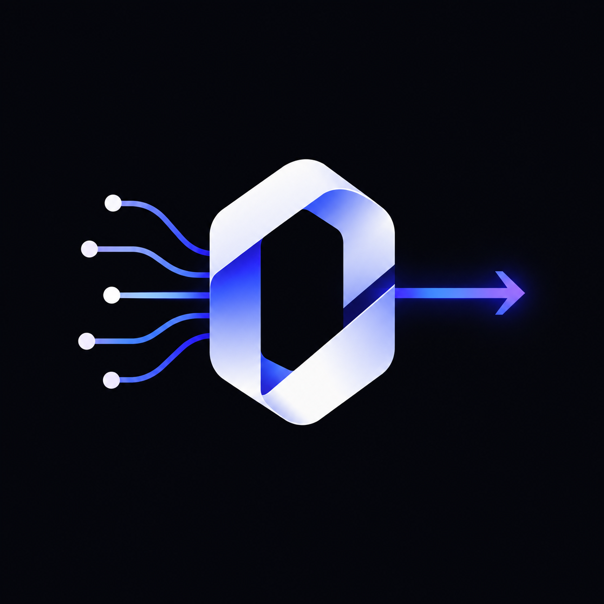
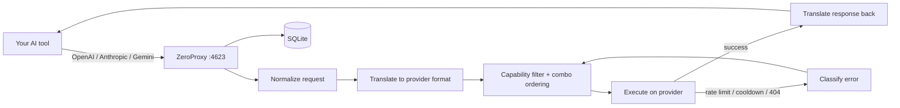

<div align="center">
  
  <h1>ZeroProxy</h1>
  <p><strong>A lightweight Rust AI proxy router that imports the entire free-tier LLM provider ecosystem — 270 providers, 137 of them free — behind one OpenAI-compatible endpoint.</strong></p>
</div>

<div align="center">

[](https://www.rust-lang.org/)
[](https://astro.build/)
[](https://sqlite.org/)
[](docs/ARCHITECTURE.md)

</div>

---

## Table of contents

- [What ZeroProxy is](#what-zeroproxy-is)
- [The free-tier catalog (the point of this project)](#the-free-tier-catalog-the-point-of-this-project)
- [Install](#install)
- [Quick start](#quick-start)
- [Connect your AI tool](#connect-your-ai-tool)
- [The API surface](#the-api-surface)
- [Combos: routing, fallback, and rotation](#combos-routing-fallback-and-rotation)
- [The dashboard](#the-dashboard)
- [CLI reference](#cli-reference)
- [Configuration](#configuration)
- [Using ZeroProxy from an AI agent](#using-zeroproxy-from-an-ai-agent)
- [Development](#development)
- [How it works](#how-it-works)
- [Project lineage](#project-lineage)
- [Secondary: MCP and A2A (extras, not headline features)](#secondary-mcp-and-a2a-extras-not-headline-features)
- [Troubleshooting](#troubleshooting)

---

## What ZeroProxy is

ZeroProxy is a single Rust binary that sits between your AI coding tools and **every AI provider you can get access to** — free tiers, OAuth accounts, API keys, and self-hosted endpoints.

You point your tool at `http://127.0.0.1:4623` and everything else becomes ZeroProxy's problem:

- **Provider catalogs you don't have to maintain.** One command imports 270 providers and their models. The free ones need no API key at all.
- **Format translation.** Send OpenAI chat completions. ZeroProxy translates to whatever the upstream provider actually speaks, and translates the response back.
- **Automatic fallback.** When a provider is rate-limited, out of credit, or down, the request moves to the next candidate instead of failing.
- **One dashboard.** Configure providers, models, combos, quota, and your CLI tools from a browser.
- **An API built for agents.** Every CLI command can emit a stable, versioned JSON envelope instead of human text.

It is a Rust rewrite in the [9router / OmniRoute / openproxy](https://github.com/decolua/9router) family, deliberately scoped to stay small: no MCP framework, no A2A/ACP bloat, no Electron shell, no memory/skills subsystem, no cloud sync, no Telegram bot.

**Everything runs on your machine.** SQLite in `~/.zeroproxy`, no account required, no telemetry.

---

## The free-tier catalog (the point of this project)

Most routers make you sign up for API keys one at a time. The open question is which providers give you something usable for free, with the least friction. ZeroProxy tracks that list automatically.

```bash
zeroproxy sync omniroute --free-only
```

That's it. One offline command reads an embedded snapshot of the
[OmniRoute](https://github.com/diegosouzapw/OmniRoute) provider registry and writes
every free provider's models into your local database as **custom models** — selectable
from the same model picker as everything else.

### What the snapshot actually contains

| | Count |
|---|---|
| Providers in the catalog | **270** |
| Providers that are free or keyless (`free: true` or `noAuth: true`) | **137** |
| Free model entries (distinct `provider/model` pairs) | **999** |
| …of which already exist as built-in models | 94 |
| …so a fresh sync actually inserts | **905** |
| Addable providers in the dashboard (built-in + generated) | **326** |

Model ids collide across providers — 999 `(provider, model)` pairs cover only 773 distinct
ids — which is why the table lists pairs, not ids.

### The flags

| Flag | Effect |
|---|---|
| *(none)* | Sync **every** provider in the snapshot, free or not. |
| `--free-only` | Sync only providers marked `free: true` **or** `noAuth: true`. |
| `--dry-run` | Print the diff. Mutate nothing. |
| `--prune` | Delete custom models tagged with this source that are no longer upstream. Built-in models, and custom models from any other source, are never touched. |
| `--source-file <PATH>` | Read a snapshot from disk instead of the embedded one — use this to test a freshly regenerated catalog without rebuilding. |

`--free-only` is careful about `--prune`: providers it skipped are still recorded as
present upstream, so pruning can't wipe the models of a paid provider you synced earlier.

`sync` works **directly on the local database** — the server does not need to be running.
(If the server *is* running, restart it afterwards; it caches the database in memory.)

### Two commands, two upstreams

```bash
zeroproxy sync omniroute      # free-tier-first, the recommended catalog
zeroproxy sync 9router        # the same idea, from decolua/9router
```

The catalog is generated by `scripts/sync/normalize-sources.mjs` into
`src/core/model/sources/*.json`, which is committed. Regenerating it is a separate,
deliberate step.

---

## Install

### From source (the reliable path today)

No GitHub release is published at the moment, so the release-binary path is not
available. Build from source:

```bash
git clone https://github.com/atheerium/ZeroProxy.git
cd ZeroProxy
cargo build --release --locked
```

The dashboard is compiled in, and `build.rs` **refuses to build** if `web/dist` is
missing. Build the dashboard first:

```bash
cd web && pnpm install --frozen-lockfile && pnpm run build && cd ..
cargo build --release --locked
```

The binary lands at `target/release/zeroproxy`.

### With the install script

`install.sh` and `install.ps1` are committed and handle the dashboard build, the
binary, the agent skill, and shell completions. It resolves a version from the GitHub
releases API and **falls back to building from source** when there is nothing to
download — so today it effectively does the above for you:

```bash
curl -fsSL https://raw.githubusercontent.com/atheerium/ZeroProxy/main/install.sh | bash
```

On Windows, in PowerShell:

```powershell
irm https://raw.githubusercontent.com/atheerium/ZeroProxy/main/install.ps1 | iex
```

Shell completions for bash, zsh, and fish are in `shell-completions/`.

### With Docker

`.github/workflows/docker-publish.yml` builds `linux/amd64` and `linux/arm64` images to
`ghcr.io/atheerium/ZeroProxy` on `v*` tags. A `Dockerfile` and `docker-compose.yml` are
included. **The `:latest` tag is not published** — the workflow only runs on tags, so
pin a version tag.

### Requirements

- Rust stable, edition 2021 (no toolchain is pinned; CI tracks `stable`)
- Node 18+ and pnpm — only to build the dashboard
- Linux, macOS, or Windows

---

## Quick start

```bash
# 1. Check the install
zeroproxy doctor

# 2. Start the server in the background
zeroproxy server start --detach

# 3. Import the free-tier catalog (270 providers, 999 free models)
zeroproxy sync omniroute --free-only

# 4. Open the dashboard
#    http://127.0.0.1:4623
```

On first run the server prints a generated admin password and mints your first admin API
key — **the password is printed once**. Set `INITIAL_PASSWORD` if you want to choose it.

```bash
# Mint an API key for your tools without reading the startup banner
zeroproxy server init
```

Then point a tool at the endpoint. See [Connect your AI tool](#connect-your-ai-tool).

To add a provider with your own key:

```bash
zeroproxy provider add my-openai '{"provider":"openai","apiKey":"sk-..."}'
zeroproxy provider test my-openai          # verify credentials and reachability
```

The dashboard is the easier path for OAuth providers (Claude, Codex, Gemini, Copilot,
and others) — it launches the browser flow for you. `zeroproxy provider oauth` does the
same from the terminal.

---

## Connect your AI tool

Every tool that speaks the OpenAI API needs three things: a **base URL**, an **API key**,
and a **model name**.

| Setting | Value |
|---|---|
| Base URL | `http://127.0.0.1:4623/v1` |
| API key | whatever you minted with `zeroproxy server init` |
| Model | any model the dashboard's picker offers |

The model picker is the single source of truth — it merges the built-in catalog, your
synced free models, and the providers you have actually configured. If a model is in the
picker, it will route.

The dashboard has a **CLI Tools** page that writes the correct config for you:
`/dashboard/cli-tools` covers OpenCode, Claude Code, Codex, Cursor, Cline, OpenClaw,
Copilot, and others, and shows you the file it wrote.

### Anthropic-native tools

Tools that speak the Anthropic Messages API can skip translation entirely:

```
ANTHROPIC_BASE_URL=http://127.0.0.1:4623
ANTHROPIC_API_KEY=<your key>
```

`POST /v1/messages` is a first-class route, not an adapter bolted onto
`/v1/chat/completions`.

---

## The API surface

One port serves four request dialects. Pick whichever your tool already speaks — no
client changes required.

| Dialect | Endpoint | Notes |
|---|---|---|
| **OpenAI** | `POST /v1/chat/completions` | The main path. |
| **OpenAI Responses** | `POST /v1/responses` | Plus `/v1/responses/compact`. |
| **Anthropic** | `POST /v1/messages` | Plus `/v1/messages/count_tokens`. |
| **Gemini** | `/v1beta/models/*` | Native Gemini passthrough. |
| **Ollama** | `POST /v1/api/chat` | For Ollama clients. |

### Chat and text

```
/v1/chat/completions            /v1/models
/v1/responses                   /v1/models/info
/v1/responses/compact           /v1/models/{kind}
```

### Media

```
/v1/embeddings                  /v1/images/generations
/v1/audio/speech                /v1/images/edits
/v1/audio/transcriptions        /v1/videos/generations
/v1/audio/voices                /v1/videos/edits
/v1/audio/music                 /v1/videos/extensions
                                /v1/videos/{id}
```

`/v1/videos/*` is the xAI Grok Imagine async-job API (POST to create, GET to poll).
`/v1/video/generations` (singular) is retained for older clients.

### Search, fetch, and the rest

```
/v1/search                      /v1/rerank
/v1/web/fetch                   /v1/moderations
/v1/chat/search
```

### Usage

```
/v1/usage          /v1/usage/summary     /v1/usage/daily
/v1/usage/history  /v1/usage/pricing
```

### Authentication

Everything under `/v1` (except `/v1/health`) needs your API key:

```bash
curl http://127.0.0.1:4623/v1/models \
  -H "Authorization: Bearer $ZEROPROXY_API_KEY"
```

These need **no** authentication at all, which makes them safe health checks:

```
/health   /api/health   /api/catalog   /metrics   /v1   /v1/health
```

### Legacy path aliases

Most `/v1/*` routes are also mounted at the bare path and at a doubled `/v1/v1/*` path,
so clients that build the prefix differently still work. Use the canonical `/v1/...`
form in anything you write.

### Management API

The dashboard and CLI drive a separate `/api/*` surface, protected by a dashboard
session or an admin key:

```
/api/keys          /api/providers      /api/nodes        /api/combos
/api/proxy-pools   /api/settings       /api/version      /api/db/export
/api/usage/*       /api/models/*       /api/headroom/*   /api/tunnel/*
```

`/metrics` is a Prometheus-format endpoint. Note that this is the built-in metrics
exporter — ZeroProxy does not ship a Prometheus or Grafana stack, and there is no
alerting subsystem.

---

## Combos: routing, fallback, and rotation

A **combo** is an ordered list of `provider/model` pairs plus a strategy. It is how you
say "try these, in this order, with these rules."

```bash
zeroproxy combo create --name my-setup \
  --models deepseek/deepseek-v4-flash,openrouter/gpt-oss-120b,openai/gpt-oss-120b \
  --strategy fallback
```

| Strategy | Behavior |
|---|---|
| `fallback` *(default)* | Walk the list in order; move on when one fails. |
| `round-robin` | Rotate across the list. |
| `sticky-round-robin` | Rotate, but keep a conversation pinned to one entry. |

Test a combo before you rely on it:

```bash
zeroproxy combo test my-setup
```

### What counts as "failed"

Fallback is driven by one error classifier, so every provider behaves the same way:

| Condition | Result |
|---|---|
| Rate limited, or a retry-able upstream error | Move to the next entry. |
| Quota exhausted / cooldown | Take that provider out of rotation, then move on. |
| A **404** on a model | Lock that *model* for 300 s. **Not** an auth failure — do not refresh tokens for it. |
| `401` / `403` | Refresh the provider's OAuth token once, then retry. |
| A request that failed to **translate** | Fall through to the next entry. It is not the provider's fault. |
| A hard-cap mismatch (needs vision/PDF/audio the model lacks) | **Skip the model entirely.** It is not a fallback trigger. |

---

## The dashboard

Served at `http://127.0.0.1:4623`. Astro 5 + React 19, built to static files and embedded
in the binary.

| Page | What it is for |
|---|---|
| `/dashboard/providers` | Configure connections. Add, edit, test, validate. |
| `/dashboard/providers/new` | Add a provider, including OAuth flows. |
| `/dashboard/providers/<id>` | **Per-provider Available Models** — enable, disable, and add custom models. Persists in SQLite. |
| `/dashboard/combos` | Build and test fallback chains. |
| `/dashboard/cli-tools` | Generate CLI config for OpenCode, Claude Code, Codex, and friends. |
| `/dashboard/playground` | Chat with any configured model from the browser. |
| `/dashboard/analytics` | Success rate, latency, and time-to-first-token, per provider. |
| `/dashboard/provider-stats` | Per-provider breakdown of the same. |
| `/dashboard/usage` | Token spend, request history, request logs, pricing. |
| `/dashboard/quota` | Quota status per provider; reset and refresh. |
| `/dashboard/proxy-pools` | Outbound proxy pools and health. |
| `/dashboard/endpoint` | The API endpoint reference and test console. |
| `/dashboard/profile` | Machine profile. |
| `/dashboard/translator` | Inspect format translation and its presets. |
| `/dashboard/token-saver` | Token-saving rules. |
| `/dashboard/compression` | Prompt-compression statistics. |
| `/dashboard/payload-rules` | Request/response payload rewrite rules. |
| `/dashboard/proxy-pools` | Proxy pool management. |
| `/dashboard/media-providers` | TTS, STT, embedding, image, and search providers. |
| `/dashboard/mitm` | MITM proxy configuration. |
| `/dashboard/pxpipe` | Pipe transport configuration. |
| `/dashboard/tunnel` | Tailscale tunnel and funnel. |
| `/dashboard/skills` | Installed agent skills. |
| `/dashboard/console-log` | Server console log viewer. |
| `/dashboard/db-backups` | Database backups and retention. |
| `/dashboard/settings/pricing` | Pricing table used for cost estimates. |

### The Available Models toggle

This is the feature most worth understanding. On a provider page you can disable
individual models, and the choice persists in SQLite and survives rebuilds.

**Custom models can never be disabled, and that is deliberate.** When a provider's whole
catalog goes dark — quota gone, outage, a bad model — a synced free model is your only
way through. An escape hatch that a bulk "disable everything" action could switch off
would not be an escape hatch. If you truly need a custom model gone, delete it.

The same list drives the model picker used by every tool and every page. They cannot
drift apart.

---

## CLI reference

26 command groups. Add `--robot` to any of them for a stable JSON envelope instead of
human-readable text.

### Providers, keys, and pools

```bash
zeroproxy provider list
zeroproxy provider add <NAME> <CONFIG_JSON>
zeroproxy provider get|edit|delete <NAME>
zeroproxy provider enable|disable <NAME>
zeroproxy provider test <NAME>              # credentials + reachability
zeroproxy provider validate <NAME>          # deeper, provider-aware validation
zeroproxy provider models <NAME>            # discover models upstream
zeroproxy provider node ...                 # provider *nodes* (multi-endpoint)
zeroproxy provider client-info              # detected client fingerprints
zeroproxy provider oauth <NAME>             # run an OAuth flow from the terminal
zeroproxy provider apply                    # flush pending changes
```

```bash
zeroproxy key list | add | get | rotate | delete | enable | disable | apply
zeroproxy pool list | status | create | delete | get | edit | enable | disable | test | stats | apply
```

### Models and routing

```bash
zeroproxy models list
zeroproxy models info <MODEL>
zeroproxy models test <MODEL>               # live probe
zeroproxy models pricing                    # pricing table
zeroproxy combo list | get | create | edit | delete | enable | disable | test | apply
```

### Catalog sync

```bash
zeroproxy sync omniroute [--free-only] [--dry-run] [--prune] [--source-file <PATH>]
zeroproxy sync 9router    [same flags]
```

### Server and auth

```bash
zeroproxy server start [--detach]
zeroproxy server stop
zeroproxy server status
zeroproxy server init                      # mint the first admin API key
zeroproxy auth login | logout | whoami | list | reset-password
```

### Usage, logs, quota

```bash
zeroproxy usage summary | daily | chart | history | stats | providers | pricing
zeroproxy usage logs | request-logs
zeroproxy usage stream                     # SSE → NDJSON
zeroproxy logs tail [--follow] | export | clear | stats
zeroproxy quota list | get | reset | refresh
```

### Database

```bash
zeroproxy db init
zeroproxy db export --out <FILE> [--scopes <LIST>]
zeroproxy db import <FILE>                 # merges by default
zeroproxy db reset --confirm RESET         # backs up first
zeroproxy db dump
```

### Everything else

```bash
zeroproxy translator formats | translate | send | preset
zeroproxy media providers | combo | tts | stt | embed | image | search | web
zeroproxy tool list | show | apply [--dry-run] | revert | execute | run | doc
zeroproxy tool antigravity-mitm
zeroproxy mitm status | start | stop | cert | config
zeroproxy tunnel enable | disable | tailscale <install|login|check|enable|disable>
zeroproxy chat models | tags | send | stream
zeroproxy settings get | set | apply | proxy-test | locale | version | update
zeroproxy schema list | show | example | stability
zeroproxy completion <SHELL>               # bash | elvish | fish | powershell | zsh
zeroproxy doctor                           # self-test: data dir, db, server health
```

`route` asks the running server how a prompt would be served for a given model or combo,
and it issues a real completion to find out — so it costs a token and needs the server up:

```bash
zeroproxy route --prompt "summarise this 40-page PDF" --model openai/gpt-4o-mini
zeroproxy route --prompt "hello" --combo my-setup
```

Most commands talk to a running server — everything in the `usage`, `settings`,
`translator`, `chat`, `models`, and `route` groups, plus `provider test` and
`provider models`, all of which make real network calls.

A few work directly against the local database and need **no** server: `sync`, `schema`,
`db`, `doctor`, `combo`, `key`, `pool`, and the `provider` CRUD commands.

> `tunnel start|stop|status` are marked **stubs** in the current build. The working
> tunnel surface is `tunnel enable|disable` and `tunnel tailscale`.

### Global flags

| Flag | Default | Notes |
|---|---|---|
| `--host` | `127.0.0.1` | Honors `$HOSTNAME`, then legacy `$HOST`. |
| `--port` | `4623` | `$PORT` |
| `--data-dir` | `~/.zeroproxy` | `$DATA_DIR` |
| `--log-filter` | `info` | `$RUST_LOG` |
| `--robot` | off | Stable `zeroproxy.v1.*` JSON. NDJSON for streaming commands. |
| `--api-key` | `$ZEROPROXY_API_KEY` | For remote management. `$CIPHERROUTE_API_KEY` also accepted. |
| `--url` | `$ZEROPROXY_URL` | Manage a remote server instead of the local DB. `$CIPHERROUTE_URL` also accepted. |
| `--profile` | — | `$ZEROPROXY_PROFILE`; profiles live in `~/.config/zeroproxy/config.toml`. |
| `--web-dir` | embedded | Serve the dashboard from disk instead of the binary. |
| `--dashboard-sidecar-url` | — | Point at an Astro dev server (`:4624`). |
| `-v` / `-q` | — | Verbosity / quiet. |
| `--no-open` | — | Do not launch a browser. |

---

## Configuration

Copy the template and edit it:

```bash
cp .env.example .env
```

### Core

| Variable | Default | Purpose |
|---|---|---|
| `PORT` | `4623` | Listen port. |
| `HOST` | `127.0.0.1` | Listen address. |
| `HOSTNAME` | — | Takes precedence over `HOST`. |
| `DATA_DIR` | `~/.zeroproxy` | Database, keys, logs. |
| `BASE_URL` | — | Public base URL. |
| `NODE_ENV` | — | `production` disables `/api/shutdown`. |

### Security

| Variable | Purpose |
|---|---|
| `JWT_SECRET` | Signs dashboard sessions. |
| `INITIAL_PASSWORD` | First admin password. Unset ⇒ generated and printed **once** at startup. |
| `CIPHERROUTE_ENCRYPTION_KEY` | 64 hex chars. Encrypts stored credentials with **AES-256-GCM** using an Argon2id-derived key. |
| `API_KEY_SECRET` | HMAC secret for API keys. Generated and persisted to `$DATA_DIR/api_key_secret` if unset. |
| `AUTH_COOKIE_SECURE` | Force the `Secure` cookie flag. |
| `SHUTDOWN_SECRET` | Guards the shutdown endpoint. |

Legacy AES-CBC (`opxenc1`-prefixed) credential values remain readable and migrate to
AES-256-GCM on the next write — you do not need to rotate anything by hand.

Argon2id cost parameters are tunable: `CIPHERROUTE_ARGON2_M_COST_KB`,
`CIPHERROUTE_ARGON2_T_COST`, `CIPHERROUTE_ARGON2_P_COST`.

> **Note on naming.** The binary is `zeroproxy` and the data directory is
> `~/.zeroproxy`, but the environment prefix is a mix, on purpose:
>
> - **The CLI/profile layer reads `ZEROPROXY_*` natively** — `ZEROPROXY_PROFILE`,
>   `ZEROPROXY_URL`, `ZEROPROXY_API_KEY`, `ZEROPROXY_DATA_DIR`, `ZEROPROXY_CONFIG`.
>   The older `CIPHERROUTE_*` spellings of those five are still accepted, so both work.
>   Precedence for the data directory is CLI flag → `DATA_DIR` →
>   `ZEROPROXY_DATA_DIR` → profile file (`src/cli/config.rs`), so a bare
>   `DATA_DIR` in your shell wins over the prefixed name.
> - **Everything below keeps the `CIPHERROUTE_*` prefix**, including
>   `CIPHERROUTE_ENCRYPTION_KEY`, the Argon2id parameters, and the per-provider
>   OAuth endpoint overrides. There is no `ZEROPROXY_*` alias for these, and adding
>   one is not a rename you can do safely: the code reads *only* the old name, so
>   docs pointing at the new one would mean an encrypted database that will not
>   decrypt.
>
> `REQUIRE_API_KEY` is **not** read from the environment at all; it is a dashboard
> setting.

### Database and backups

| Variable | Default |
|---|---|
| `DB_BACKUP_MAX_FILES` | `7` |
| `DB_BACKUP_RETENTION_DAYS` | `30` |
| `DISABLE_AUTO_BACKUP` | unset |

### Streaming and logging

| Variable | Default | Purpose |
|---|---|---|
| `STREAM_STALL_TIMEOUT_MS` | `360000` | Give up on a silent stream. |
| `STREAM_FIRST_CHUNK_TIMEOUT_MS` | `200000` | Give up waiting for the first chunk. |
| `ENABLE_REQUEST_LOGS` | — | Persist full request logs. |
| `REQUEST_LOG_DIR` | — | Where they go. |
| `ENABLE_TRANSLATOR` | — | Enable format translation. |

### Provider endpoints

Any provider's OAuth or API base URL can be overridden — useful for proxies, regional
endpoints, and self-hosted gateways:

```
CIPHERROUTE_CLAUDE_*_URL     CIPHERROUTE_CODEX_*_URL     CIPHERROUTE_GEMINI_*_URL
CIPHERROUTE_XAI_*_URL        CIPHERROUTE_KIRO_*_URL     CIPHERROUTE_OPENAI_*_URL
CIPHERROUTE_IFLOW_*_URL      CIPHERROUTE_CLINE_*_URL     CIPHERROUTE_VERCEL_*_URL
CIPHERROUTE_DENO_*_URL       CIPHERROUTE_ANTIGRAVITY_*_URL
AZURE_OPENAI_*               GOOGLE_APPLICATION_CREDENTIALS
```

Plus OIDC (`OIDC_ISSUER`, `OIDC_CLIENT_ID`, `OIDC_CLIENT_SECRET`, `OIDC_REDIRECT_URI`)
for dashboard single-sign-on, and `HTTP_PROXY` / `HTTPS_PROXY` / `NO_PROXY` for
outbound egress.

---

## Using ZeroProxy from an AI agent

ZeroProxy is built so an agent can drive it without scraping human-formatted text.

### `--robot`

Add `--robot` to any command. Output becomes a stable, versioned JSON envelope:

```bash
zeroproxy provider list --robot
zeroproxy usage stream --robot        # NDJSON, one object per event
```

No banners, no color, no progress spinners. Errors go to stderr.

### The schema is frozen

Every envelope is in the `zeroproxy.v1` namespace and is **stable, additive-only**:

```
$ zeroproxy schema stability
zeroproxy.v1: stable (additive-only changes; v2 will open before any break)
```

Inspect it before you parse it:

```bash
zeroproxy schema list
zeroproxy schema show <resource>
zeroproxy schema example <resource>
```

13 resources: `provider`, `provider-node`, `combo`, `key`, `pool`, `settings`,
`custom-model`, `model-alias`, `usage-event`, `log-event`, `chat-event`, `quota`,
`oauth-status`. New fields may appear. Existing ones will not change type or meaning. If
something must break, a `zeroproxy.v2` namespace opens first.

### Remote management

Manage a server on another machine, or one you cannot open a browser for:

```bash
export ZEROPROXY_URL=http://box.local:4623
export ZEROPROXY_API_KEY=<admin key>
zeroproxy provider list                # talks to the remote server
```

`--url` and `--api-key` override the environment, so you can target several servers from
one shell using `--profile`.

### An agent skill is installed for you

The install script places a ZeroProxy skill (`.agents/skills/zeroproxy/`) so your agent
knows the commands, the ports, and the failure modes without having to rediscover them.
It is also in this repo.

---

## Development

```bash
./scripts/dev.sh              # foreground
./scripts/dev.sh --fast detach        # build + restart in the background (~10-20s)
./scripts/dev.sh --web-only           # dashboard only, no cargo
./scripts/dev.sh --backend-only       # Rust only, no pnpm
./scripts/dev.sh --full detach        # fmt + clippy + astro + tests, then restart
./scripts/dev.sh --check              # lint only
```

Run it from the repo root. It resolves its own root, so your working directory does not
matter. `detach` mode verifies that the process actually listening on the port is the
binary you just built, then gates on `curl http://127.0.0.1:4623/health`.

### Reload contract

| What changed | What to run |
|---|---|
| `src/**` | `./scripts/dev.sh --fast detach` |
| `src/core/model/provider_catalog.json` | `./scripts/dev.sh --fast detach` — the catalog is embedded at compile time; a restart is **not** enough |
| `web/src/**` | `./scripts/dev.sh --web-only` — `--web-dir` serves from disk live |
| Database or config only | `./scripts/restart.sh` — no rebuild |
| Before any push or "done" claim | `./scripts/dev.sh --full detach` |

### The test gate

```bash
cargo test --lib --all-features
```

Unit tests live in `src/**` as `#[cfg(test)]` modules and need no network. The CI `rust`
job **only runs tests on Linux** — a green macOS run proves fmt and clippy, nothing more.
`cargo clippy --all-targets --all-features` gates on real errors, not warnings.

Web:

```bash
pnpm --dir web test        # vitest
```

`astro check` is advisory everywhere. Fix new errors; do not chase the backlog.

### Repository layout

```
src/core/         domain logic: routing, translation, executors, combos, usage
src/server/       axum HTTP, the router, dashboard embedding, auth
src/cli/          clap CLI and the --robot JSON envelopes
src/db/           SQLite (WAL), migrations, AES-GCM credential columns
src/oauth/        token refresh flows
web/              Astro 5 + React 19 dashboard → web/dist
scripts/          dev.sh, restart.sh, sync/ (catalog generation)
docs/             ARCHITECTURE.md and the 9router parity notes
```

The request pipeline:

```
model parsing → format detection → request translation → capability-aware ordering
  → provider execution → response translation → SSE streaming
```

---

## How it works


```mermaid
flowchart LR
  C[Your AI tool] -->|OpenAI / Anthropic / Gemini| P[ZeroProxy :4623]
  P --> N[Normalize request]
  N --> X[Translate to provider format]
  X --> R[Capability filter + combo ordering]
  R --> E[Execute on provider]
  E -->|success| S[Translate response back]
  E -->|rate limit / cooldown / 404| F[Classify error]
  F --> R
  S --> C
  P --> D[(SQLite)]
```

Three design points worth knowing:

**Capability filtering happens before routing.** If your request needs vision, PDF, or
audio input, a model that lacks it is *skipped entirely* rather than tried and failed.
This is not a fallback trigger.

**Fallback has exactly one classifier.** Every provider's errors funnel through one
function, so a rate limit means the same thing everywhere. Nothing re-implements
status-code logic locally — that is how the "failed to translate" bug class happens.

**Custom models are keyed `provider/model-id`.** Model ids are only unique *within* a
provider, so a bare id would let two providers offering `gpt-oss-120b` silently overwrite
each other.

---

## Project lineage

```
9router (decolua/9router) — JavaScript/Next.js, the original
  ├── OmniRoute (diegosouzapw/OmniRoute) — TypeScript fork, the active catalog upstream
  └── openproxy (quangdang46/openproxy) — Rust rewrite
        └── ZeroProxy (atheerium/ZeroProxy) — this project
```

ZeroProxy tracks **OmniRoute's** free-tier provider list, model catalog, and model
conventions. When something looks familiar across all four, it is shared ancestry rather
than coincidence.

The name changed on the way here — the binary was `cipherroute`, then `openproxy`, now
`zeroproxy`; the schema namespace was `cipherroute.v1`. Those legacy names survive in
environment variables and a few internal paths on purpose, because renaming them would
break existing deployments.

---

## Secondary: MCP and A2A (extras, not headline features)

ZeroProxy exposes two optional protocol adapters. They are registered and working, but
they are **not** part of the product's core — the free-tier catalog, provider routing,
combos and the CLI are. They are documented here so nothing is hidden, not because you
need them. AGENTS.md's standing guidance is that these are bloat that should not be
ported from upstream; they are here because they already exist, not because they are
planned to grow. Neither has a dashboard page — both are API-only.

### MCP — let an MCP client drive the router

Two independent modes:

**Native server mode** implements MCP JSON-RPC 2.0 directly, with a built-in registry of
**17 administrative tools** so a client such as Claude Desktop, Cursor or Cline can
inspect and change the router without a child process:

| Tool | Purpose |
|---|---|
| `provider_list` / `provider_create` / `provider_delete` / `provider_test` | provider connections |
| `key_list` / `key_create` / `key_delete` | API keys |
| `combo_list` / `combo_create` | combos |
| `pool_list` / `pool_create` / `pool_delete` | proxy pools |
| `node_list` | provider nodes |
| `models_list` | model catalog |
| `health` | router health |
| `settings_get` | settings read |
| `usage_status` | quota and usage status |

```
POST /api/mcp                      # stateless JSON-RPC — no SSE needed
GET  /api/mcp-server/sse           # long-lived SSE transport
POST /api/mcp-server/message       # SSE message channel
```

Verbs handled: `initialize`, `tools/list`, `tools/call`, `resources/list`,
`resources/read`.

> **These routes carry no authentication at all, under any setting.** `mcp::routes()`
> and `mcp_server::routes()` are merged with no `route_layer`
> (`src/server/api/mod.rs:400-401`), and the only app-wide layer is a metrics and
> request-id counter, applied explicitly "before any auth" (`mod.rs:411`). The
> `provider_create`, `key_create` and `*_delete` tools are reachable by anyone who can
> open a TCP connection. Verified against a running server: an unauthenticated
> `tools/list` returns the full tool list. On the default loopback bind that is tolerable;
> if you set `HOST=0.0.0.0` to reach the router from your LAN, this becomes a real hole
> and you need a reverse proxy with auth in front of it.

**Stdio-bridge mode** spawns external MCP child processes and bridges their stdio to SSE,
for plugins configured locally:

```
GET  /api/mcp/{plugin}/sse
POST /api/mcp/{plugin}/message
```

### A2A — expose the router as an agent

Publishes a ZeroProxy Agent Card so another agent can discover and call it. These routes
do carry an auth layer — `route_layer(guard::require_admin)` at `src/server/api/a2a.rs:41` —
but read that as conditional, not absolute. `require_admin` accepts a valid management API
key or dashboard password, and otherwise **fails open**: if the dashboard has no password
set, or `require_login` is off, it returns `Ok` for anyone (`src/server/api/mod.rs:658`).
The guard only bites once you have set a dashboard password and enabled login, which is the
recommended configuration anyway. The MCP routes above have no such layer under any
setting.

| Route | Purpose |
|---|---|
| `GET /.well-known/agent.json` | standard Agent Card discovery |
| `GET /api/a2a/agent-card` | the same card as JSON |
| `POST /api/a2a/tasks/send` | submit a task |
| `GET /api/a2a/tasks/{id}` | task status |
| `POST /api/a2a/tasks/{id}/cancel` | cancel a task |

Card capabilities: streaming on, push notifications off, state-transition history on.

---

## Troubleshooting

**`zeroproxy` will not start: port 4623 is "in use" but nothing is running.**
Check the *address*, not the port number:

```bash
ss -tlnp | grep 4623
```

A socket on a different interface — a Tailscale funnel, for instance — cannot block
`127.0.0.1:4623` and is not a conflict. Use `pgrep -x zeroproxy`, not `pgrep -f`, which
matches its own invoking shell.

**The process I killed came back.**
A systemd user unit restarts it. Stop the unit instead of killing the process:

```bash
systemctl --user stop zeroproxy
```

`dev.sh` and `restart.sh` already do this.

**A change I made is not showing up.**
Check what is actually running:

```bash
pgrep -x zeroproxy | xargs -I{} tr '\0' ' ' < /proc/{}/cmdline   # is --web-dir set?
```

If `--web-dir` is missing, the server is serving assets embedded at build time and your
`web/dist` edits are invisible. See the reload contract above.

**The dashboard shows my old build.**
The navbar badge tells you which version *you* are running, and names the stale layer.
If it says `unknown`, that is not "fresh" — it means it could not determine freshness.

**I changed the database out-of-band and the API still shows the old data.**
The server caches the database in memory. `./scripts/restart.sh`. No rebuild needed.

**A free provider suddenly stopped routing.**
Look for a model lock. A 404 locks that model for 300 seconds; a cooldown takes the
provider out of rotation for longer. `zeroproxy usage logs` shows which.

---

## License

MIT — see [LICENSE](LICENSE).

---

## Contributing

Read [AGENTS.md](AGENTS.md) first — it is the authoritative brief for agents working in
this repo, and it records the traps that have already cost real debugging time. For
humans: [CONTRIBUTING.md](CONTRIBUTING.md) and [docs/git-conventions.md](docs/git-conventions.md).

One agent, one branch, one worktree:

```bash
git worktree add ../wt-my-change -b agent/feat/my-change
./scripts/claim-branch.sh agent/feat/my-change
```

Do not share a branch between concurrent changes.
